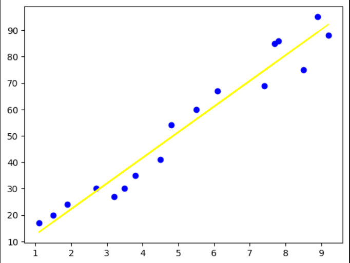

# Implementation-of-Simple-Linear-Regression-Model-for-Predicting-the-Marks-Scored

## AIM:
To write a program to predict the marks scored by a student using the simple linear regression model.

## Equipments Required:
1. Hardware – PCs
2. Anaconda – Python 3.7 Installation / Jupyter notebook

## Algorithm
1. Import the required libraries and read the dataframe.
2. Assign hours to X and scores to Y.
3. Implement training set and test set of the dataframe
4. Plot the required graph both for test data and training data.
5. Find the values of MSE , MAE and RMSE.

## Program:
```
/*
Program to implement the simple linear regression model for predicting the marks scored.
Developed by: Shri Sai Aravind. R
RegisterNumber:  212223040197
*/
```
```py
import pandas as pd
import numpy as np
import matplotlib.pyplot as plt
#import libraries to find mae, mse

#read csv file
df= pd.read_csv("student_scores.csv")
#displaying the content in datafile
df.head()
df.tail()

# Segregating data to variables
Hours  = df[["Hours"]]
Scores = df["Scores"]
print("Hours")

Hours
df[["Scores"]]

#splitting train and test data
from sklearn.model_selection import train_test_split
x_train, x_test, y_train, y_test = train_test_split(Hours, Scores, test_size = 0.3, random_state = 42)

#import linear regression model and fit the model with the data
from sklearn.linear_model import LinearRegression
model = LinearRegression().fit(x_train,y_train)
ypred = model.predict(x_test)

#displaying actual values
d = pd.DataFrame({"Actual Values":y_test, "Predicted": ypred})
print(d)

#graph plot for training data
plt.scatter(x_train, y_train, color = 'blue', label = 'Training data')
plt.plot(x_train, model.predict(x_train), color = 'yellow', label = 'Regression line')

#graph plot for test data
plt.scatter(x_test, y_test, color = 'red', label = 'Training data')
plt.plot(x_test, ypred, color = 'orange', label = 'Regression line')

#find mae,mse,rmse
from sklearn.metrics import mean_absolute_error,mean_squared_error, root_mean_squared_error
print(f"MAE: {mean_absolute_error(y_test,ypred)}, MSE: {mean_squared_error(y_test,ypred)}, RMSE: {root_mean_squared_error(y_test,ypred)}")
```

## Output:

### df.head()


### df.tail()


### Hours Values


### Scores Values


### Actual values vs predicted values


### Training Data and Regression line


### Testing Data and regression line


### MAE, MSE and RMSE values
```
MAE: 4.499999999999998, MSE: 23.61945761415174, RMSE: 4.859985351228103
```

## Result:
Thus the program to implement the simple linear regression model for predicting the marks scored is written and verified using python programming.
